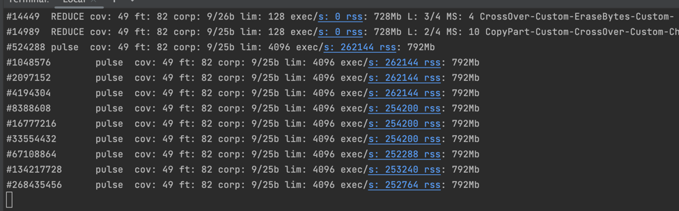

Этапы работ: 

Были написаны классы - цели фаззинга. Папка FuzzingProject/src/main/java/ru/hse

С помощью команд:

./jazzer --cp=FuzzingProject.jar --agent_path=./jazzer_standalone.jar --target_class=ru.hse.{ClassName}

были запущены данные файлы и найдены некоторые ошибки. 
Результаты работы фаззера можно найти в папке FuzzingProject/src/main/java

Ошибки: 

1:
Цель фаззинга:
--target_class=ru.hse.CalcSubtractionFuzzTarget

Лог ошибки:
at java.base/java.lang.String.charAt(String.java:1555)
at calc.Calc.calculate(Calc.java:126)

Место в коде:
// Считываем первый символ
switch (sTmp.charAt(1)) {

Как исправить:
// Считываем первый символ
switch (sTmp.charAt(0)) {

2:
После исправления было проведено тестирование и ошибки не нашлись на момент сдачи работы,
так как фаззинг работает долго.

